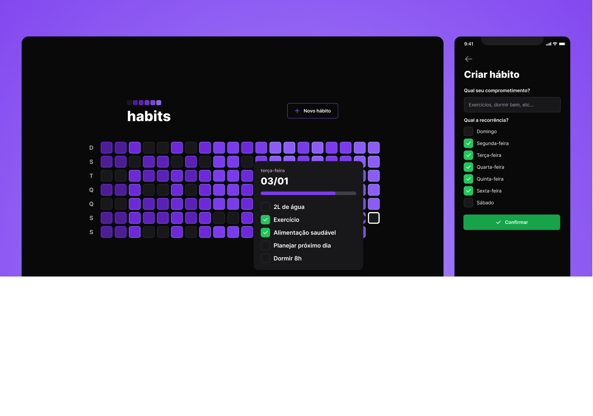

<p align="center">
  
</p>
   <h1 align="center">Habits</h1>
 </p>
<br />
<p align="center"> 
   
	 
  	<a href="https://github.com/brunosduarte/habits/commits/master"> 
   		 
 	</a> 
  	<a href="https://opensource.org/licenses/MIT"> 
   		 
  	</a> 
</p>

## 🗂 Contents

- 📋 [Project](#-project)
  - 🚀 [Technologies](#-technologies)
  - 📷 [Preview](#-preview)
- 📦 [Instalation](#-instalation)
- ⚖️ [License](#%EF%B8%8F-license)
- 📫 [Contact](#-contact)

## 📋 Project

An full stack application (web and mobile version) for monitoring daily tasks to help users track their completed and incomplete
activities.

### 🚀 Technologies

[](https://skillicons.dev)

## 📷 Preview

##### 💻 frontend:

<p align="center"> 
  
</p>

## 📦 Instalation

To clone and run this application, you will need [Git][git], [NodeJS v18.17.1][nodejs] or higher + [npm v9.17.1][npm] or higher, and [PNPm 8.7.5][pnpm] installed on your computer. In your terminal, run:

```bash
# Cloning repo
$ git clone https://github.com/brunosduarte/habits.git habits
```

```bash
# Backend

# Go to the repository
$ cd server

# Install the dependencies
$ yarn

# Run the API
$ yarn dev

# Note: After running the command above, the API will be available at http://localhost:3333

```

```bash
# Frontend

# Got to the repository
$ cd web

# Install dependencies
$ yarn i

# Execute
$ yarn dev
```


```bash
# Mobile

# Got to the repository
$ cd mobile

# Install dependencies
$ yarn

# Execute
$ yarn start
```

## ⚖️ License

This project is under license. [MIT](LICENSE).

## 📫 Contact

by [**Bruno Duarte**](https://www.linkedin.com/in/brunosduarte/) 🚀

[git]: https://git.scm.com
[nodejs]: https://nodejs.org/
[npm]: https://www.npmjs.com/
[PNPm]: https://pnpm.io/p
